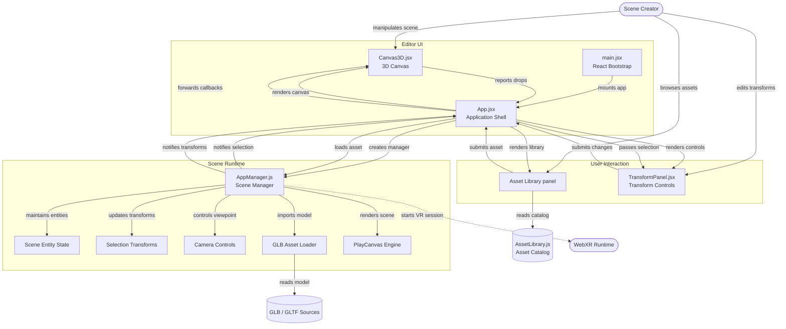

# VR World Builder

A browser-based 3D scene editor, built on [PlayCanvas](https://playcanvas.com/), that lets a user drag environments and objects into a scene, adjust them, and step into the result via WebXR.

## Getting Started

**Prerequisites:** Node.js 26 or later, and npm.

```bash
npm install
npm run dev
```

Then open the URL the terminal prints (Vite's default is `http://localhost:5173`). No further setup is needed — PlayCanvas is installed as an npm dependency rather than loaded from a CDN, so the first `npm install` pulls in everything the editor needs.

Other scripts, once you have them:

| Command | Purpose |
|---|---|
| `npm run dev` | Start the local dev server with hot reload |
| `npm run build` | Production build |
| `npm run preview` | Serve the production build locally, to sanity-check it before deploying |

**Testing VR:** the editor runs fine in any WebGL2 browser for building and editing. To actually enter VR you'll need a WebXR-capable browser on a headset (e.g. the Meta Quest browser) pointed at a `localhost` or HTTPS URL — WebXR refuses to start on plain HTTP.

## Project Structure

```
src/
  main.jsx                    # React bootstrap — mounts <App />
  App.jsx                     # Application shell — owns top-level state, wires UI to the engine
  components/
    Editor/
      Canvas3D.jsx             # Hosts the PlayCanvas <canvas>; forwards pointer/drop events up to App
      AssetLibraryPanel.jsx    # Drag-and-drop library of environments & objects, plus upload-your-own
      TransformPanel.jsx       # Position / rotation / scale controls for the current selection
      ModelImporter.jsx        # Earlier file/URL upload form — superseded by AssetLibraryPanel's
                                # built-in uploader; check whether it's still referenced anywhere
                                # before removing it
    Controls/
      CharacterControls.jsx    # WASD/arrow-key walk & run input
      useKeyboardMovement.js   # Keyboard state tracking hook used by CharacterControls
      keyBindings.js           # Key → movement-action mapping, kept separate so remapping is one edit
  playcanvas/
    AppManager.js              # Scene Manager — owns the PlayCanvas Application instance
    AssetLibrary.js            # Asset Catalog — static list of built-in library items
    environments.js            # Built-in environment presets (sky / ground / ambient colour sets)
```

## Architecture

Four layers, matching the diagram in this repo (`diagram.png`):



**Editor UI** — `main.jsx` mounts `App.jsx`, which renders `Canvas3D.jsx` and passes it callbacks (`onSelectionChange`, `onTransformChange`, drop handling). `Canvas3D.jsx` owns nothing but the `<canvas>` element and event wiring; it has no scene logic of its own.

**User Interaction** — the Asset Library panel and `TransformPanel.jsx` are presentational. `App.jsx` renders them and pushes state down (the current selection, the item catalog); they only ever call back up (`submits changes`, `submits asset`) rather than touching the engine directly.

**Scene Runtime** — `AppManager.js` is the single class that owns the actual PlayCanvas `Application` instance. Everything that needs per-frame engine access lives here: the entity map, position/rotation/scale setters, camera modes (orbit, standing-inside, walk/run), and GLB loading. `App.jsx` talks to it only through its public methods (`loadGlbAsset`, `setEntityPosition`, `enterVR`, etc.) and its two callbacks (`onSelectionChange`, `onTransformChange`) — nothing outside `AppManager.js` touches a `pc.Entity` directly.

**Data layer** — `AssetLibrary.js` is a static list of built-in environments/objects (no network request, no loading state). Anything dragged in from outside that list — an uploaded `.glb`/`.gltf` file or a pasted URL — goes through the same `loadGlbAsset` path as a catalog item, so custom and built-in models behave identically once they're in the scene.

### Why it's split this way

- **The engine never imports React, and React never imports PlayCanvas types.** `AppManager.js` is plain JS with no React dependency, so it could be dropped into a non-React shell later without changes. All communication crosses through plain callbacks and plain data (arrays of numbers for position/rotation, not `pc.Vec3` instances).
- **`App.jsx` is the only component that holds an engine reference.** Every other component gets pre-bound callbacks, never the raw `AppManager` instance — that keeps the "what can touch the 3D scene" surface to one file.
- **Everything that needs a per-frame update lives in `AppManager.js`.** Camera movement, drag-to-place, and selection outlines all hook into PlayCanvas's own `update` event rather than a React render loop, since a React re-render is the wrong trigger for animating a camera 60 times a second.

### Known gaps worth flagging in the report

- `ModelImporter.jsx` looks superseded by `AssetLibraryPanel.jsx`'s built-in upload form — worth confirming it's unused and removing it, so the "Editor UI" diagram doesn't drift from the actual code.
- Character movement (walk/run) covers translation only; there's no collision or ground-following yet, so it's possible to walk through placed objects or off the edge of an environment's mesh.
