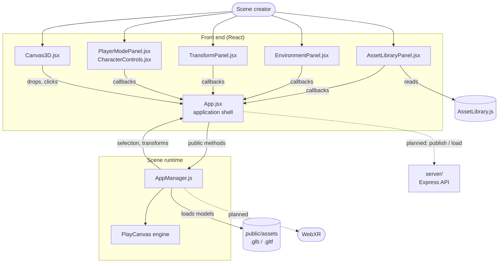

# VR World Builder

A browser-based 3D world builder for children, built on the [PlayCanvas](https://playcanvas.com/) engine. Users drag environments and objects into a scene, arrange them, change the sky and ground, walk around as a character, and (in progress) publish the world and step into it in VR through WebXR.

Final-year project: *Build it in 3D, Step Inside it in VR*.

## Getting started

**Prerequisites:** Node.js 22 or later, and npm.

```bash
npm install
npm run dev        # front end, http://localhost:5173
npm run server     # backend API, http://localhost:3001 (second terminal)
```

Run both commands from the repo root, where `index.html` is. Vite forwards any request to `/api/...` to the backend, so the browser only talks to one address.

| Command | Purpose |
|---|---|
| `npm run dev` | Front-end dev server with hot reload |
| `npm run server` | Backend API, restarts when server files change |
| `npm run build` | Production build into `dist/` |
| `npm run preview` | Serve the production build locally to check it |

In production, `npm run build` then `node server/index.js` serves both the API and the built front end from one process.

**Testing VR:** building and editing work in any WebGL2 browser. Entering VR needs a WebXR browser on a headset (for example the Meta Quest browser) loading the site over HTTPS or `localhost`. WebXR will not start on plain HTTP.

## Project structure

```
index.html                    # Entry page; loads apps/web/src/main.jsx
vite.config.js                # Vite config: public folder location, /api proxy
package.json

apps/web/
  public/assets/              # Static files served from the site root (/assets/...)
    objects/                  # Placeable objects (.glb)
      old_rusty_car.glb
      low_poly_person.glb
    environments/             # Whole-scene environments
      american_school_classroom_interior_high-poly.glb
      city/                   # glTF environment: scene.gltf + scene.bin + textures/
        license.txt           #   (these must stay together)
  src/
    main.jsx                  # React entry point; mounts <App />
    App.jsx                   # Application shell: top-level state, wires UI to the engine
    index.css
    assets/
      AssetLibrary.js         # Catalog of built-in objects and environments shown in the library
    components/
      Editor/
        Canvas3D.jsx          # Hosts the PlayCanvas <canvas>; forwards pointer and drop events
        AssetLibraryPanel.jsx # Object/environment library, plus upload of your own .glb/.gltf
        EnvironmentPanel.jsx  # Skybox (gradient or image) and ground texture settings
        TransformPanel.jsx    # Position, rotation and scale of the selected object
      Controls/
        CharacterControls.jsx # Keyboard walk/run input
        usekeyboardMovement.jsx # Hook tracking which movement keys are held
        Keybindings.js        # Key → movement action mapping
        PlayerModePanel.jsx   # Pick an object to control; normal / 1st / 3rd person camera
      Generator/
        PromptPanel.jsx       # Text prompt UI for AI-generated assets (not wired in yet)
    playcanvas/
      AppManager.js           # Owns the PlayCanvas Application: entities, camera, loading, XR
    services/
      index.js                # Placeholder for front-end API calls (empty)

server/
  index.js                    # Express app: /api routes, serves dist/ in production
  route/
    publish.js                # POST /api/scenes (publish, returns room code), GET /api/scenes/:code
    generate.js               # /api/generate: text-to-3D jobs (stub, returns 501)
  data/                       # Published scenes as JSON files (created at runtime, not in git)
```

## Architecture


```mermaid
flowchart TD
    User([Scene creator])

    subgraph UI["Front end (React)"]
        App["App.jsx<br/>application shell"]
        Canvas["Canvas3D.jsx"]
        Library["AssetLibraryPanel.jsx"]
        Env["EnvironmentPanel.jsx"]
        Transform["TransformPanel.jsx"]
        Player["PlayerModePanel.jsx<br/>CharacterControls.jsx"]
    end

    subgraph Runtime["Scene runtime"]
        Manager["AppManager.js"]
        Engine["PlayCanvas engine"]
    end

    Catalog[("AssetLibrary.js")]
    Files[("public/assets<br/>.glb / .gltf")]
    API["server/<br/>Express API"]
    XR(["WebXR"])

    User --> Canvas & Library & Env & Transform & Player
    Library -->|reads| Catalog
    Library & Env & Transform & Player -->|callbacks| App
    Canvas -->|drops, clicks| App
    App -->|public methods| Manager
    Manager -->|selection, transforms| App
    Manager --> Engine
    Manager -->|loads models| Files
    Manager -.->|planned| XR
    App -.->|planned: publish / load| API
```

**Front end.** `App.jsx` holds top-level state and renders the panels. Panels are presentational: they receive state as props and report user actions through callbacks. None of them touch the engine directly.

**Scene runtime.** `AppManager.js` is the only code that owns PlayCanvas objects. It manages the entity map, selection and transforms, camera modes (orbit, first person, third person), player movement with simple collision, skybox and terrain, proximity interactions, and model loading. `App.jsx` uses it only through its public methods (`loadGlbAsset`, `setSkyboxImage`, `setTerrainTexture`, `enterVR`, ...) and its callbacks.

**Assets.** Library items and user uploads both go through `AppManager.loadGlbAsset()`, which uses PlayCanvas's `container` loader and accepts `.glb` and `.gltf`. Library URLs point at `public/assets/`, which is served from the site root, so `apps/web/public/assets/objects/old_rusty_car.glb` is loaded as `/assets/objects/old_rusty_car.glb`. Uploaded files are held as temporary `blob:` URLs in the browser and are not yet saved anywhere.

**Backend.** A small Express server. Published scenes are stored as JSON files and retrieved by a six-character room code that avoids easily confused characters (0/O, 1/I/L).

## Adding a built-in asset

1. Put the file in `apps/web/public/assets/objects/` or `.../environments/`. A `.gltf` with separate `.bin` and texture files gets its own folder.
2. Add an entry to `apps/web/src/assets/AssetLibrary.js` with a URL starting `/assets/...` (no `public`).
3. Record the source and licence under [Credits](#credits).

Large models should be optimised before use, since a Quest headset has far less memory and GPU power than a laptop:

```bash
npx @gltf-transform/cli optimize "path/to/scene.gltf" "path/to/out.glb" --texture-compress webp --texture-size 1024
```

## Status

| Area | State |
|---|---|
| Editor: place, select, transform, delete objects | Working |
| Skybox, terrain texture, collision, player mode | Working |
| Proximity interactions | Engine side done; no UI to assign them yet |
| Saving / loading scenes | Not started (scene format to be defined) |
| Publishing | Backend routes done; front end not connected |
| VR viewing | `enterVR()` exists; no button, locomotion or controller input yet |
| AI-generated assets | UI stub only; backend returns 501 |

## Credits

- "full_gameready_city_buildings" by [ap-school](https://sketchfab.com/ap-school), [Sketchfab](https://sketchfab.com/3d-models/full-gameready-city-buildings-19d5a4e5416c458982486e608a34930b), licensed under [CC-BY-4.0](http://creativecommons.org/licenses/by/4.0/).
- `old_rusty_car.glb`, `low_poly_person.glb`, `american_school_classroom_interior_high-poly.glb`: source and licence to be added.
